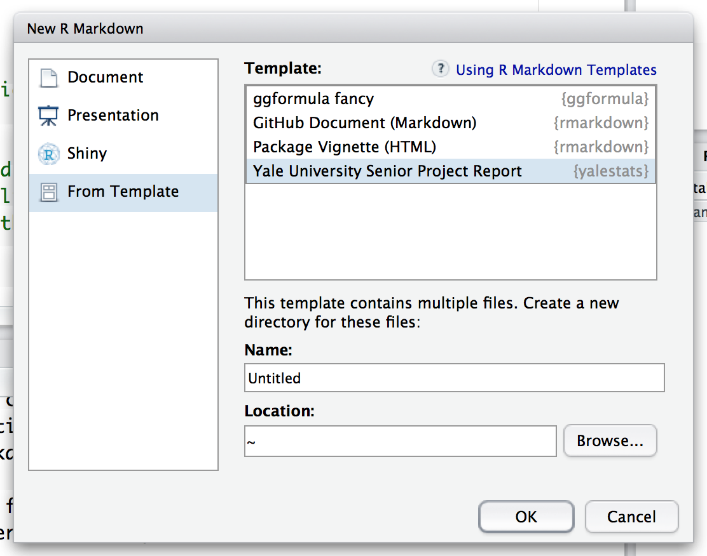

### Overview

The **yalestats** package (derived from an older version of Chester Ismay's **reedtemplates** package at `ismayc/reedtemplates` with only minor modifications) includes a  [R Markdown](http://rmarkdown.rstudio.com) template for the Yale University Senior Project report. If you'd like to see the PDF document the template produces, it can be found [here]().

Under the hood, LaTeX templates are used to ensure that documents conform precisely to submission standards. At the same time, composition and formatting can be done using lightweight [markdown](http://rmarkdown.rstudio.com/authoring_basics.html) syntax, and **R** code and its output can be seamlessly included using [knitr](http://yihui.name/knitr/).

The **yalestats** package has some prerequisites which are described below. To compile PDF documents using **R**, you are going to need to have LaTeX installed.  It can be downloaded for Windows at <http://http://miktex.org/download> and for Mac at <http://tug.org/mactex/mactex-download.html>.  Follow the instructions to install the necessary packages after downloading the (somewhat large) installer files.  You may need to install a few extra LaTeX packages on your first attempt to knit as well.

### Installation/Usage

To use **yalestats** from RStudio:

* Within RStudio, install the package:

```
install.packages("devtools")
devtools::install_github("swang87/yalestats")
```

* Use the **New R Markdown** dialog to create an article from one of the templates:



### Troubleshooting

* For the following error on a Mac:

```
pandoc: Error running filter pandoc-citeproc:
Could not find executable 'pandoc-citeproc'.
Error: pandoc document conversion failed with error 83
```

Try installing `pandoc-citeproc` manually in the Terminal via: `brew install pandoc-citeproc`.
